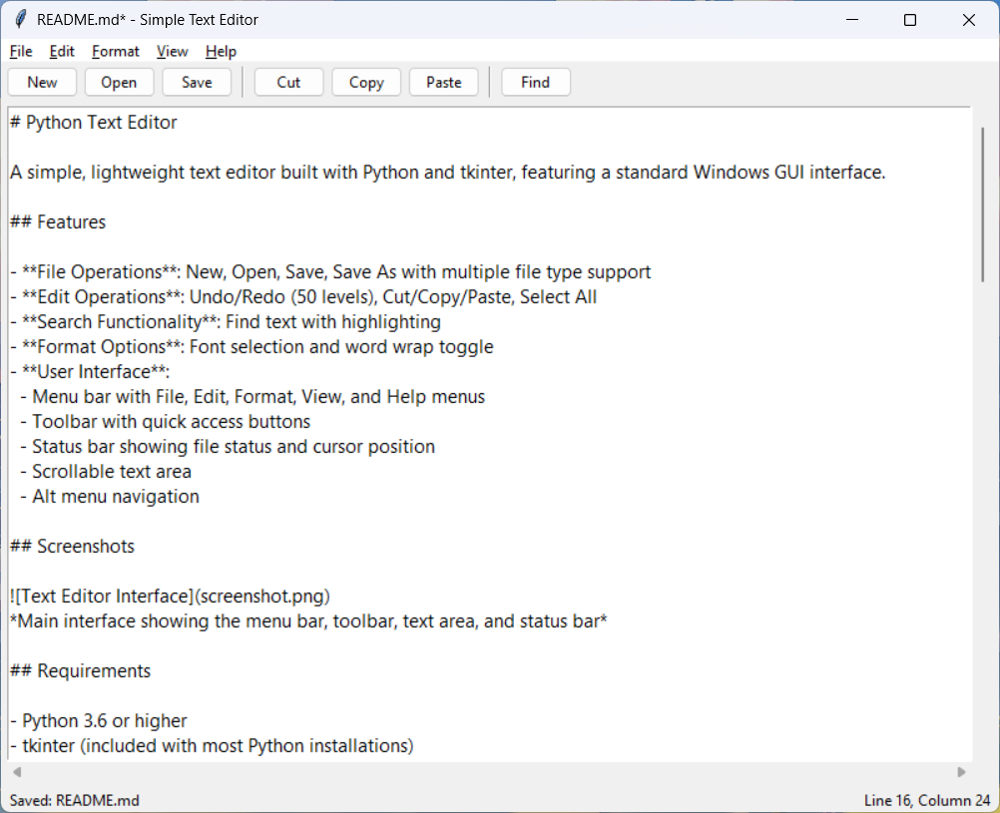

# Python Text Editor

A simple, lightweight text editor built with Python and tkinter, featuring a standard Windows GUI interface.

## Features

- **File Operations**: New, Open, Save, Save As with multiple file type support
- **Edit Operations**: Undo/Redo (50 levels), Cut/Copy/Paste, Select All
- **Search Functionality**: Find text with highlighting
- **Format Options**: Font selection and word wrap toggle
- **User Interface**: 
  - Menu bar with File, Edit, Format, View, and Help menus
  - Toolbar with quick access buttons
  - Status bar showing file status and cursor position
  - Scrollable text area

## Screenshots


*Main interface showing the menu bar, toolbar, text area, and status bar*

## Requirements

- Python 3.6 or higher
- tkinter (included with most Python installations)

## Installation

1. Clone this repository:
   ```bash
   git clone https://github.com/yourusername/python-text-editor.git
   cd python-text-editor
   ```

2. Make sure you have the tkinter library installed (Linux):
   ```bash
   sudo apt install python3-tk
   ```

2. Make sure you have the tkinter library installed (Windows):
   ```bash
   python -m pip install requests
   ```

3. Run the text editor:
   ```bash
   python text_editor.py
   ```

## Usage

### Keyboard Shortcuts

- **Ctrl+N**: New file
- **Ctrl+O**: Open file
- **Ctrl+S**: Save file
- **Ctrl+Shift+S**: Save As
- **Ctrl+Z**: Undo
- **Ctrl+Y**: Redo
- **Ctrl+X**: Cut
- **Ctrl+C**: Copy
- **Ctrl+V**: Paste
- **Ctrl+A**: Select All
- **Ctrl+F**: Find

### File Support

The editor supports various file types:
- Text files (*.txt)
- Python files (*.py)
- All files (*.*)

## Features in Detail

### Text Editing
- Multi-level undo/redo system
- Standard clipboard operations
- Text search with highlighting
- Cursor position tracking

### File Management
- Open multiple file types
- Save with encoding support (UTF-8)
- Unsaved changes detection
- Auto-updating window title

### Customization
- Font family and size selection
- Word wrap toggle
- Status bar visibility toggle

## Contributing

1. Fork the repository
2. Create a feature branch (`git checkout -b feature/amazing-feature`)
3. Commit your changes (`git commit -m 'Add some amazing feature'`)
4. Push to the branch (`git push origin feature/amazing-feature`)
5. Open a Pull Request

## License

This project is licensed under the MIT License - see the [LICENSE](LICENSE) file for details.

## Author

Created by Chris Eaton with the assistance of Warp Terminal with Python and tkinter for a simple, cross-platform text editing experience.

## Acknowledgments

- Built using Python's built-in tkinter library
- Inspired by classic text editors like Notepad++
- Designed for simplicity and functionality
